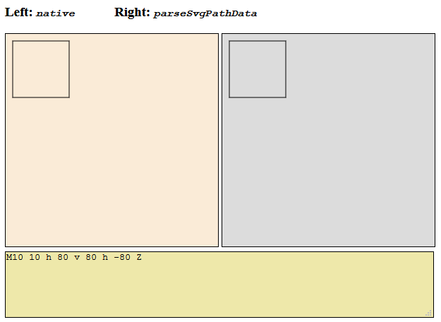

[](https://github.com/goessner/parseSvgPathData/license.txt)
[](https://www.npmjs.com/package/parse-svg-path-data/)
[](https://www.npmjs.com/package/parse-svg-path-data)
[](https://github.com/goessner/parseSvgPathData)

# parseSvgPathData

<code>parseSvgPathData</code> is a SVG path data micro-parser for parsing the [path data attribute](https://developer.mozilla.org/en-US/docs/Web/SVG/Attribute/d) of the [SVG `<path>` element](https://developer.mozilla.org/en-US/docs/Web/SVG/Element/path) as a single JavaScript function.

```js
function parseSvgPathData(data,[ifc],[ctx])
```

* `data` is the SVG path data string (e.g. `"M 100 100 L 300 100 L 200 300 z"`).
* `ifc` is an interface object [optional] (see below)
* `ctx` is a context object the interface methods will operate on [optional].
* `return`'s the context object.



[Try it by yourself]()

The fact that a user defined interface object should be supported, was considered a critical feature here. Similar libraries, which do not support this, are:

* [parse-svg-path](https://github.com/jkroso/parse-svg-path) A minimal svg path parser 
* [svg-path-parser](https://github.com/hughsk/svg-path-parser) A parser for SVG's path syntax
* [svg-pathdata](https://github.com/nfroidure/svg-pathdata) Parse SVG PathDatas

## Interface Object

Interface objects need to have the following interface structure:

```js
 {
    init(ctx),

    A(rx,ry,rot,fA,fS,x,y),
    C(x1,y1,x2,y2,x,y),
    H(x),
    L(x,y),
    M(x,y),
    Q(x1,y1,x,y),
    S(x2,y2,x,y),
    T(x,y),
    V(y),
    Z(),

    a(rx,ry,rot,fA,fS,x,y),
    c(x1,y1,x2,y2,x,y),
    h(x),
    l(x,y),
    m(x,y),
    q(x1,y1,x,y),
    s(x2,y2,x,y),
    t(x,y),
    v(y),
    z()
}
```

`parseSvgPathData` comes with two implemented Interfaces as members of the 
`parseSvgPathData` function object itself.

* `parseSvgPathData.defaultIfc`
* `parseSvgPathData.canvasIfc`

Have a look into the source how these interface objects are implemented and start to implement your own custom interface object.

### `defaultIfc`

When calling the `parseSvgPathData` function without interface object `ifc` and context `ctx` parameters (e.g. `parseSvgPathData('M0,0 L100,0')`), the default interface object `parseSvgPathData.defaultIfc` will be taken. 

By using this interface object the command segments are simplified and mapped to a minimal set of absolute path commands `[A,L,M,C]` in object notation.

So parsing the path data `M37,17v15H14V17z M50,0H0v50h50z` using this interface object will result in the object structure:

```json
[ {"type":"M","x":37,"y":17},
  {"type":"L","x":37,"y":32},
  {"type":"L","x":14,"y":32},
  {"type":"L","x":14,"y":17},
  {"type":"L","x":37,"y":17},
  {"type":"M","x":50,"y":0},
  {"type":"L","x":0,"y":0},
  {"type":"L","x":0,"y":50},
  {"type":"L","x":50,"y":50},
  {"type":"L","x":50,"y":0}
]
```

### `canvasIfc`

`canvasIfc` is another interface object, which is supplied with `parseSvgPathData`. Here every path command will invoke corresponding `HTML canvas 2D` methods. The following will render the path data in a given canvas element:

```js
const ctx = document.getElementById('canvas').getContext('2d')
// ...
parseSvgPathData('M10,10 L100,10',parseSvgPathData.canvasIfc,ctx);
ctx.stroke()
ctx.fill()
```

You might know, that `CanvasRenderingContext2D` supports the [`Path2D` interface](https://developer.mozilla.org/en-US/docs/Web/API/Path2D). So we can also use it with `parseSvgPathData`

```js
const path = new Path2D();
// ...
parseSvgPathData('M10,10 L100,10',parseSvgPathData.canvasIfc,path);
```
or even simpler

```js
const path = parseSvgPathData('M10,10 L100,10',
                              parseSvgPathData.canvasIfc,
                              new Path2D());
```
Please note, that `parseSvgPathData` might be useful despite the fact, that `Path2D` natively understands and supports SVG path data.

```js
const path = new Path2D('M10,10 L100,10');
```
You can see the results of both the native and `parseSvgPathData` output side by side here.

## License

`parseSvgPathData.js` is licensed under the terms of the MIT License. See [License](https://github.com/goessner/parseSvgPathData/license.txt) for details.

## FAQ

--

# Change Log

All notable changes to this project will be documented here. This project adheres to Semantic Versioning.

## 0.2.0 - 2018-04-15

### First Commit to Github
